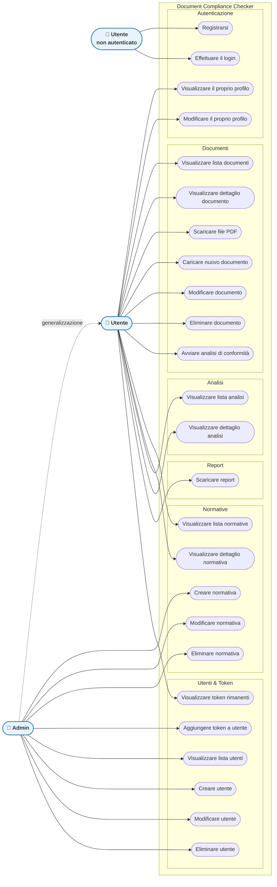
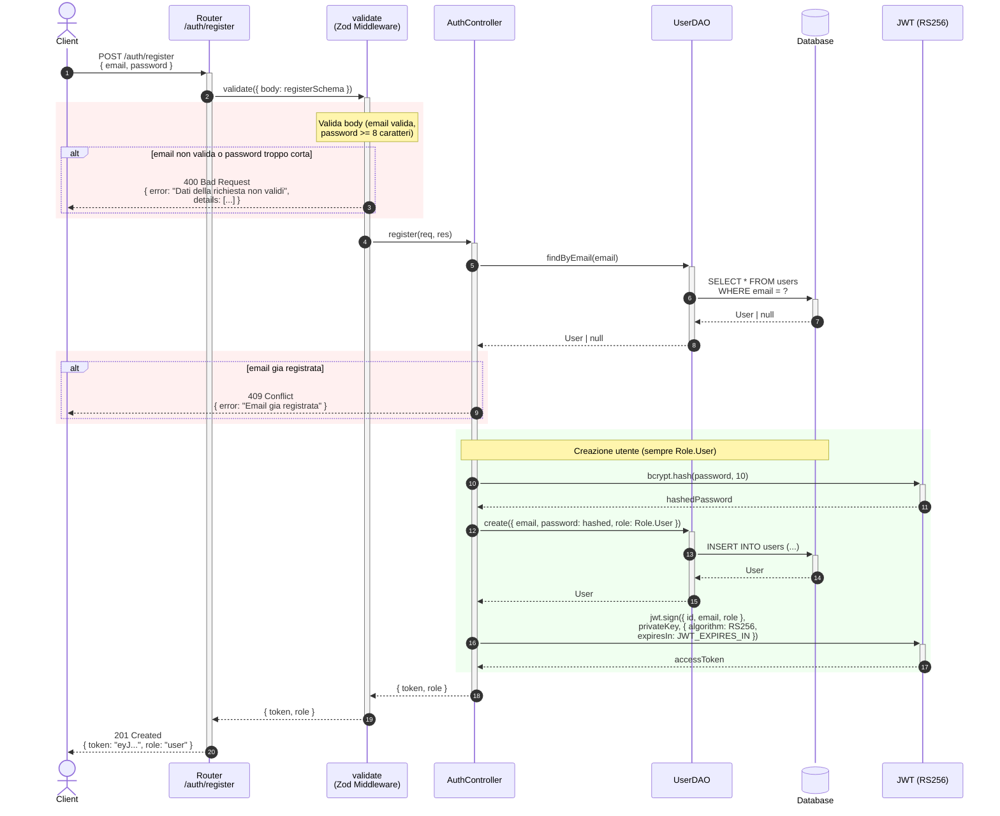
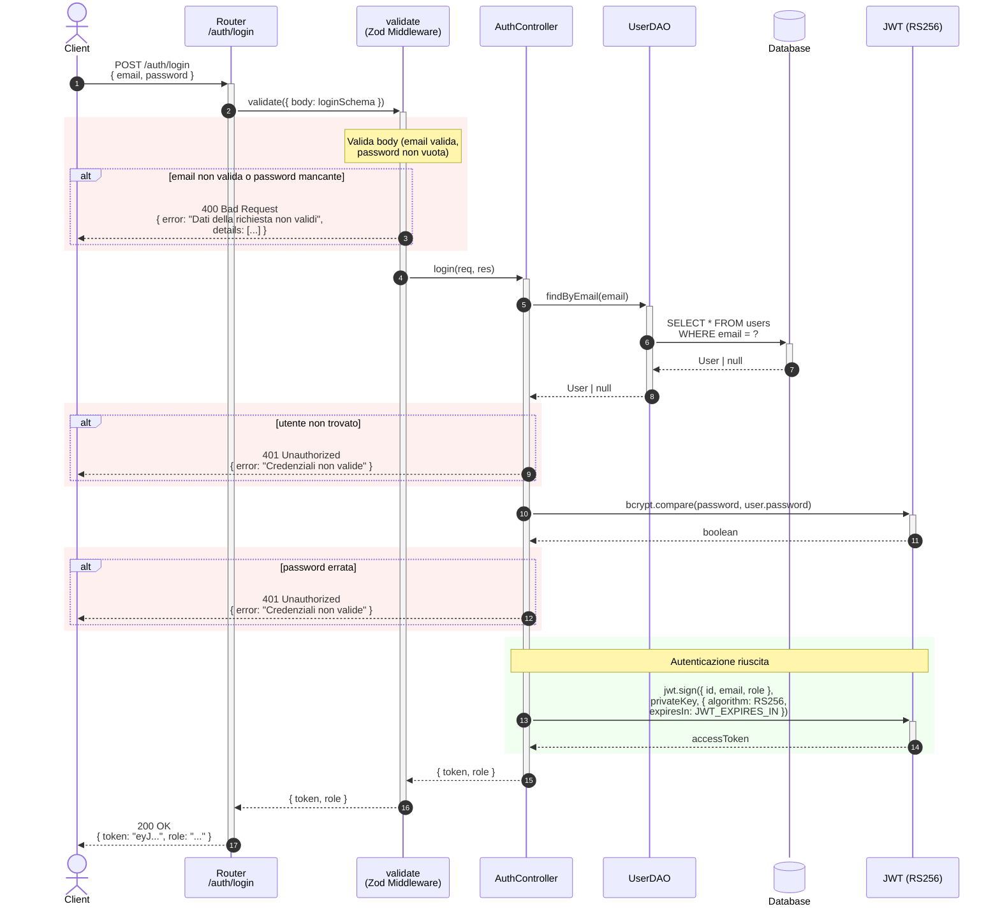
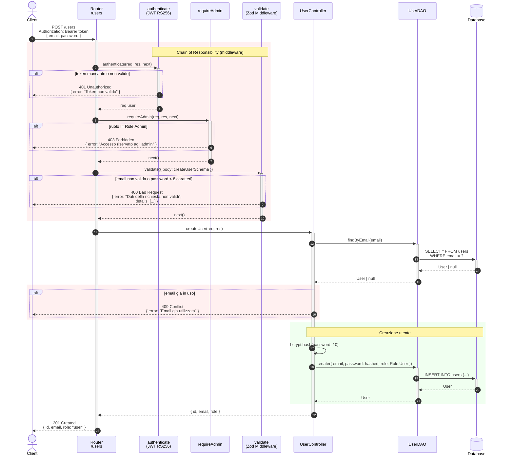
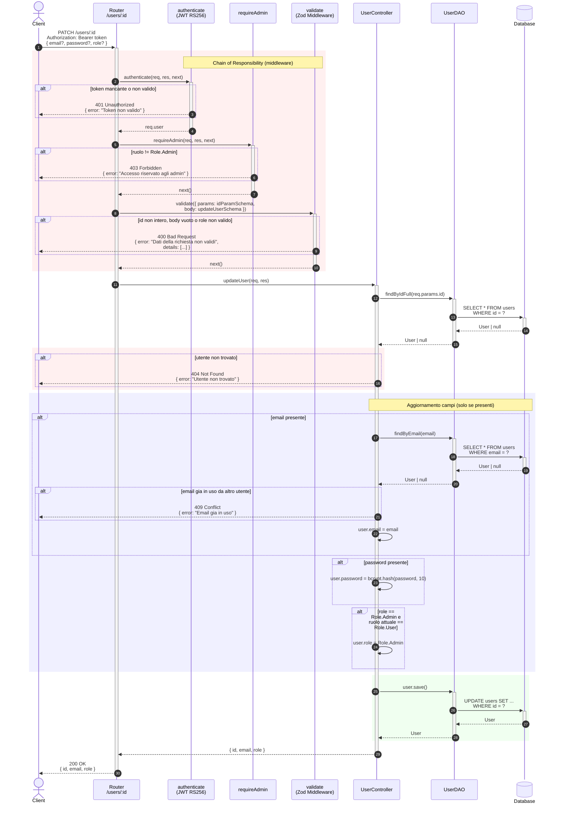
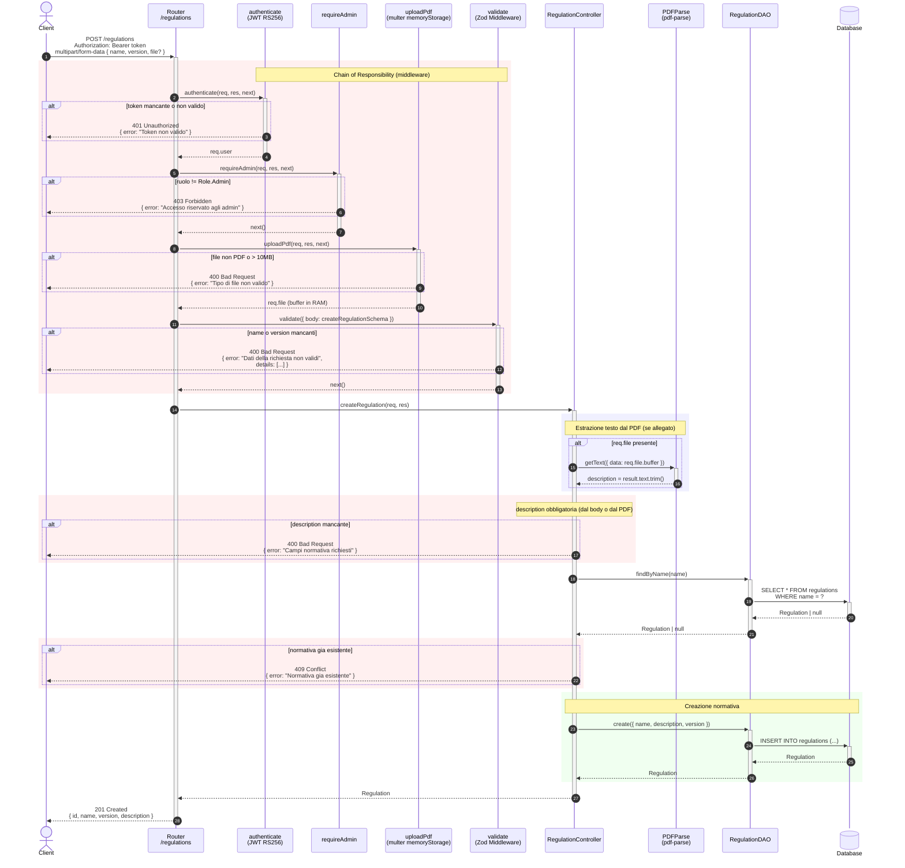
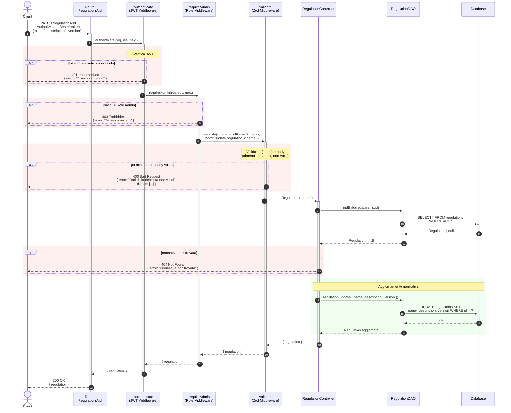
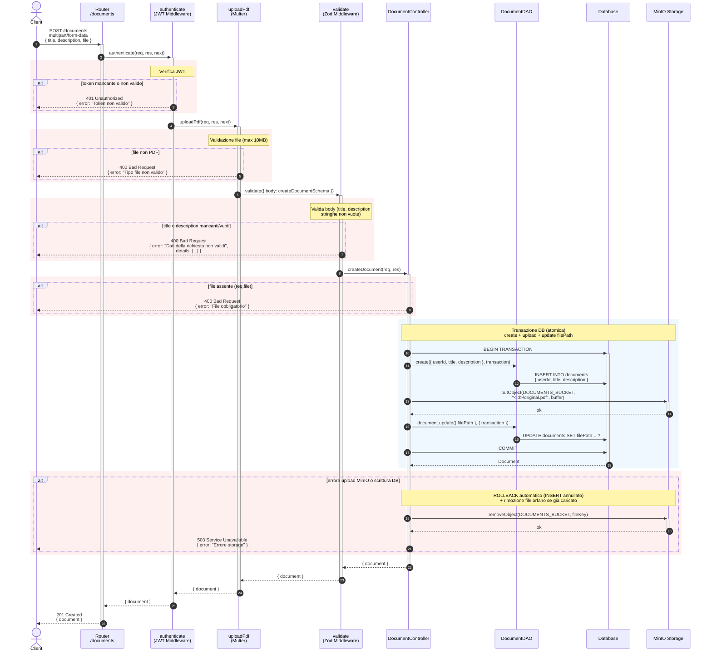
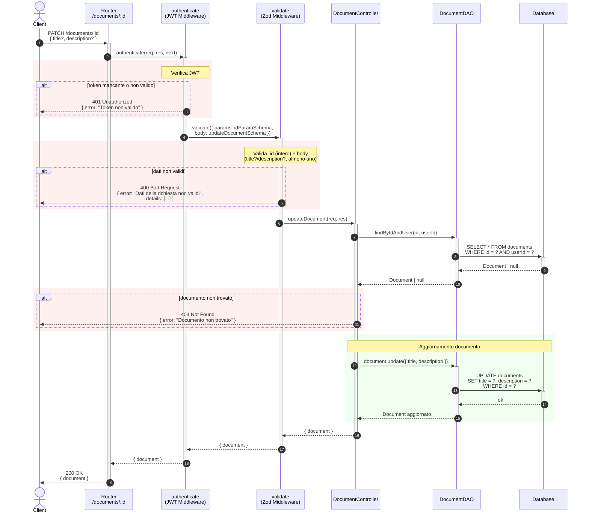
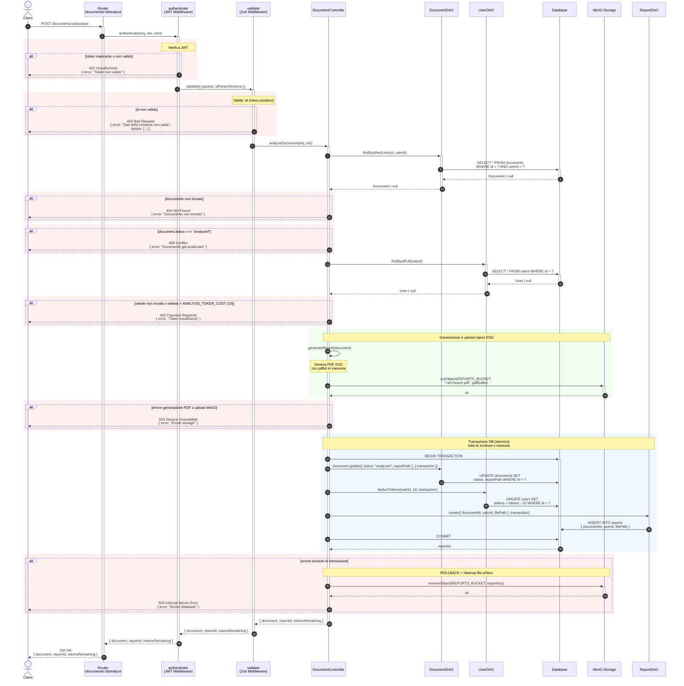

# Programmazione Avanzata — Document Compliance Checker

## Indice

| Sezione | Contenuto |
|--------|-----------|
| [Obiettivo del Progetto](#obiettivo-del-progetto) | Scopo del backend e funzionalita principali |
| [Diagramma dei Casi d'Uso](#diagramma-dei-casi-duso) | Attori e interazioni principali con il sistema |
| [Rotte Disponibili](#rotte-disponibili) | Panoramica completa degli endpoint |
| [Autenticazione](#autenticazione) | Login e registrazione |
| [Utenti](#utenti) | CRUD utenti e gestione token |
| [Normative](#normative) | Catalogo normative e operazioni admin |
| [Documenti](#documenti) | Gestione metadati e avvio analisi |
| [Analisi](#analisi) | Recupero analisi precedenti |
| [Report](#report) | Download report generati |
| [Design Pattern Implementati](#design-pattern-implementati) | Pattern architetturali usati |
| [Avvio del Servizio](#avvio-del-servizio) | Esecuzione locale con Docker |
| [Testing](#testing) | Collection Postman ed environment |
| [Note](#note) | Software e tecnologie usate |
| [Autore](#autore) | Team e riferimenti GitHub |

## Obiettivo del Progetto
Il progetto consiste nell'implementare il backend del progetto realizzato per l'Hack-AI-Thon, volto a verificare la conformità di documenti rispetto a normative ESG.
Gli utenti autenticati possono caricare i metadati di un documento e richiederne l'analisi: il sistema produce un'`Analysis` con i relativi `ComplianceResult`, esportabile come report.

Le operazioni principali sono:
* Autenticazione e registrazione con rilascio di JWT firmati in RS256
* Gestione utenti (solo admin)
* Gestione del catalogo normative (lettura pubblica, scrittura solo admin)
* Gestione dei metadati dei documenti e avvio analisi
* Consultazione delle analisi e dei risultati di conformità
* Recupero e download dei report

## Diagramma dei Casi d'Uso

Il diagramma mostra i tre attori del sistema e le operazioni che ciascuno può compiere. L'**Admin** eredita tutti i casi d'uso dell'**Utente autenticato** e ha accesso esclusivo alle operazioni di gestione.



## Rotte Disponibili

### Autenticazione

Le **rotte di autenticazione** permettono all'utente di registrarsi e di effettuare il login.

| METODO | ROTTA | JWT RICHIESTO | DESCRIZIONE |
|--------|-------|---------------|-------------|
| `POST` | /auth/register | No | Registra un nuovo utente e restituisce un token JWT |
| `POST` | /auth/login | No | Verifica le credenziali e restituisce un token JWT |
| `GET` | /auth/me | Si | Restituisce all'utente le proprie informazioni |
| `PATCH` | /auth/me | Si | Permette all'utente di modificare le proprie informazioni |

---

#### POST /auth/register

Registra un nuovo utente nel sistema assegnandogli automaticamente il ruolo `user`. Dopo la registrazione avvenuta con successo, viene restituito un token JWT pronto all'uso.

**Body richiesta:**
```json
{
  "email": "user@example.com",
  "password": "password123"
}
```
> La password deve contenere almeno 8 caratteri.

**Errori possibili:**
- `400 Bad Request` — email non valida o password troppo corta
- `409 Conflict` — email già registrata

**Successo:** `201 Created` — Ritorna il token JWT e il ruolo `user`



---

#### POST /auth/login

Verifica le credenziali dell'utente e, se corrette, restituisce un token JWT firmato in RS256 da utilizzare nelle richieste successive.

**Body richiesta:**
```json
{
  "email": "user@example.com",
  "password": "password123"
}
```

**Errori possibili:**
- `400 Bad Request` — email non valida o password mancante
- `401 Unauthorized` — credenziali errate (utente non trovato o password sbagliata)

**Successo:** `200 OK` — Ritorna il token JWT e il ruolo dell'utente



---

#### GET /auth/me

Restituisce le informazioni del profilo dell'utente autenticato (email, ruolo, token rimanenti).


**Errori possibili:**
- `401 Unauthorized` — token mancante o non valido

**Successo:** `200 OK` — Ritorna `{ id, email, role, tokens }`

---

#### PATCH /auth/me

Permette all'utente autenticato di aggiornare il proprio profilo (email e/o password).


**Body richiesta** (almeno un campo):
```json
{
  "email": "nuova@email.com",
  "password": "nuovaPassword123"
}
```

**Errori possibili:**
- `400 Bad Request` — body vuoto o dati non validi
- `401 Unauthorized` — token mancante o non valido
- `409 Conflict` — email già in uso da un altro utente

**Successo:** `200 OK` — Ritorna i dati aggiornati dell'utente

---

### Utenti

Le **rotte relative agli utenti** permettono all'**admin** di effettuare operazioni **CRUD** relativamente alle informazioni degli utenti.

| METODO | ROTTA | JWT RICHIESTO | DESCRIZIONE |
|--------|-------|---------------|-------------|
| `GET` | /users | Sì (admin) | Restituisce la lista di tutti gli utenti |
| `GET` | /users/:id | Sì (admin) | Restituisce i dati di un singolo utente |
| `POST` | /users | Sì (admin) | Crea un nuovo utente |
| `PATCH` | /users/:id | Sì (admin) | Modifica i dati di un utente esistente |
| `DELETE` | /users/:id | Sì (admin) | Elimina un utente |
| `GET` | /users/token | Sì | Restituisce il numero di token rimanenti all'utente |
| `POST` | /users/:id/token | Sì (admin) | Permette all'admin di aggiungere token ad un utente |

---

#### GET /users

Restituisce la lista completa di tutti gli utenti registrati nel sistema. Accessibile solo agli amministratori.


**Errori possibili:**
- `401 Unauthorized` — token mancante o non valido
- `403 Forbidden` — l'utente non ha il ruolo admin

**Successo:** `200 OK` — Ritorna un array di `{ id, email, role, tokens }`

---

#### GET /users/:id

Restituisce i dati di un singolo utente dato il suo `id`. Accessibile solo agli amministratori.


**Parametri URL:**
- `id` — intero positivo, identificatore dell'utente

**Errori possibili:**
- `400 Bad Request` — id non valido
- `401 Unauthorized` — token mancante o non valido
- `403 Forbidden` — l'utente non ha il ruolo admin
- `404 Not Found` — utente non trovato

**Successo:** `200 OK` — Ritorna `{ id, email, role, tokens }`

---

#### POST /users

Crea un nuovo utente nel sistema. Operazione riservata agli amministratori. Il ruolo assegnato di default è `user`.


**Body richiesta:**
```json
{
  "email": "nuovo@utente.com",
  "password": "password123"
}
```

**Errori possibili:**
- `400 Bad Request` — email non valida o password troppo corta (< 8 caratteri)
- `401 Unauthorized` — token mancante o non valido
- `403 Forbidden` — l'utente non ha il ruolo admin
- `409 Conflict` — email già in uso

**Successo:** `201 Created` — Ritorna `{ id, email, role: "user" }`



---

#### PATCH /users/:id

Aggiorna i dati di un utente esistente (email, password, ruolo). Operazione riservata agli amministratori. Il ruolo può essere promosso solo da `user` ad `admin` e non viceversa.


**Parametri URL:**
- `id` — intero positivo, identificatore dell'utente

**Body richiesta** (almeno un campo):
```json
{
  "email": "aggiornata@email.com",
  "password": "nuovaPassword123",
  "role": "admin"
}
```

**Errori possibili:**
- `400 Bad Request` — id non valido, body vuoto o ruolo non riconosciuto
- `401 Unauthorized` — token mancante o non valido
- `403 Forbidden` — l'utente non ha il ruolo admin
- `404 Not Found` — utente non trovato
- `409 Conflict` — email già in uso da un altro utente

**Successo:** `200 OK` — Ritorna `{ id, email, role }`



---

#### DELETE /users/:id

Elimina definitivamente un utente dal sistema. Operazione riservata agli amministratori.


**Parametri URL:**
- `id` — intero positivo, identificatore dell'utente

**Errori possibili:**
- `400 Bad Request` — id non valido
- `401 Unauthorized` — token mancante o non valido
- `403 Forbidden` — l'utente non ha il ruolo admin
- `404 Not Found` — utente non trovato

**Successo:** `200 OK` — Conferma dell'eliminazione

---

#### GET /users/token

Restituisce il numero di token rimanenti dell'utente autenticato.


**Errori possibili:**
- `401 Unauthorized` — token mancante o non valido

**Successo:** `200 OK` — Ritorna `{ tokens: <numero> }`

---

#### POST /users/:id/token

Aggiunge token all'account di un utente specifico. Operazione riservata agli amministratori.


**Parametri URL:**
- `id` — intero positivo, identificatore dell'utente

**Body richiesta:**
```json
{
  "amount": 50
}
```

**Errori possibili:**
- `400 Bad Request` — id non valido o quantità non positiva
- `401 Unauthorized` — token mancante o non valido
- `403 Forbidden` — l'utente non ha il ruolo admin
- `404 Not Found` — utente non trovato

**Successo:** `200 OK` — Ritorna i token aggiornati dell'utente

---

### Normative

Le **rotte delle normative** permettono agli utenti di ottenere la lista delle normative e all'admin di poter modificare quest'ultima.

| METODO | ROTTA | JWT RICHIESTO | DESCRIZIONE |
|--------|-------|---------------|-------------|
| `GET` | /regulations | Sì | Restituisce la lista di tutte le normative |
| `GET` | /regulations/:id | Sì | Restituisce i dettagli di una singola normativa |
| `POST` | /regulations | Sì (admin) | Aggiunge una nuova normativa al catalogo |
| `PATCH` | /regulations/:id | Sì (admin) | Modifica una normativa esistente |
| `DELETE` | /regulations/:id | Sì (admin) | Elimina una normativa dal catalogo |

---

#### GET /regulations

Restituisce la lista completa di tutte le normative presenti nel catalogo.


**Errori possibili:**
- `401 Unauthorized` — token mancante o non valido

**Successo:** `200 OK` — Ritorna un array di `{ id, name, version, description }`

---

#### GET /regulations/:id

Restituisce i dettagli di una singola normativa dato il suo `id`.


**Parametri URL:**
- `id` — intero positivo, identificatore della normativa

**Errori possibili:**
- `400 Bad Request` — id non valido
- `401 Unauthorized` — token mancante o non valido
- `404 Not Found` — normativa non trovata

**Successo:** `200 OK` — Ritorna `{ id, name, version, description }`

---

#### POST /regulations

Aggiunge una nuova normativa al catalogo. La descrizione può essere fornita direttamente nel body oppure estratta automaticamente da un file PDF allegato. Operazione riservata agli amministratori.


**Body richiesta** (`multipart/form-data`):
```
name        → nome della normativa (es. "ISO 14001")
version     → versione (es. "2015")
file        → (opzionale) file PDF da cui estrarre la descrizione
```
> Se non viene allegato un PDF, il campo `description` deve essere incluso nel body.

**Errori possibili:**
- `400 Bad Request` — nome o versione mancanti, file non PDF o descrizione assente
- `401 Unauthorized` — token mancante o non valido
- `403 Forbidden` — l'utente non ha il ruolo admin
- `409 Conflict` — normativa con lo stesso nome già esistente

**Successo:** `201 Created` — Ritorna `{ id, name, version, description }`



---

#### PATCH /regulations/:id

Aggiorna i campi di una normativa esistente (nome, descrizione, versione). Operazione riservata agli amministratori.


**Parametri URL:**
- `id` — intero positivo, identificatore della normativa

**Body richiesta** (almeno un campo):
```json
{
  "name": "ISO 14001 aggiornata",
  "description": "Nuova descrizione",
  "version": "2024"
}
```

**Errori possibili:**
- `400 Bad Request` — id non intero o body vuoto
- `401 Unauthorized` — token mancante o non valido
- `403 Forbidden` — l'utente non ha il ruolo admin
- `404 Not Found` — normativa non trovata

**Successo:** `200 OK` — Ritorna la normativa aggiornata



---

#### DELETE /regulations/:id

Elimina definitivamente una normativa dal catalogo. Operazione riservata agli amministratori.


**Parametri URL:**
- `id` — intero positivo, identificatore della normativa

**Errori possibili:**
- `400 Bad Request` — id non valido
- `401 Unauthorized` — token mancante o non valido
- `403 Forbidden` — l'utente non ha il ruolo admin
- `404 Not Found` — normativa non trovata

**Successo:** `200 OK` — Conferma dell'eliminazione

---

### Documenti

Le **rotte dei documenti** permettono agli utenti di ottenere ed inviare nuovi documenti per l'analisi.

| METODO | ROTTA | JWT RICHIESTO | DESCRIZIONE |
|--------|-------|---------------|-------------|
| `GET` | /documents | Sì | Restituisce la lista dei documenti dell'utente |
| `GET` | /documents/:id | Sì | Restituisce i dettagli di un singolo documento |
| `GET` | /documents/:id/file | Sì | Scarica il file PDF originale del documento |
| `POST` | /documents | Sì | Carica i metadati di un nuovo documento |
| `PATCH` | /documents/:id | Sì | Modifica i metadati di un documento esistente |
| `DELETE` | /documents/:id | Sì | Elimina un documento |
| `POST` | /documents/:id/analyze | Sì | Avvia l'analisi di conformità su un documento |

---

#### GET /documents

Restituisce la lista di tutti i documenti caricati dall'utente autenticato.


**Errori possibili:**
- `401 Unauthorized` — token mancante o non valido

**Successo:** `200 OK` — Ritorna un array di `{ id, title, description, status, createdAt }`

---

#### GET /documents/:id

Restituisce i dettagli di un singolo documento dell'utente autenticato.


**Parametri URL:**
- `id` — intero positivo, identificatore del documento

**Errori possibili:**
- `400 Bad Request` — id non valido
- `401 Unauthorized` — token mancante o non valido
- `404 Not Found` — documento non trovato o non appartenente all'utente

**Successo:** `200 OK` — Ritorna `{ id, title, description, status, filePath, createdAt }`

---

#### GET /documents/:id/file

Scarica il file PDF originale associato a un documento dell'utente. Il file viene recuperato da MinIO e restituito come stream.


**Parametri URL:**
- `id` — intero positivo, identificatore del documento

**Errori possibili:**
- `400 Bad Request` — id non valido
- `401 Unauthorized` — token mancante o non valido
- `404 Not Found` — documento non trovato o file non disponibile

**Successo:** `200 OK` — Ritorna il file PDF con `Content-Type: application/pdf`

---

#### POST /documents

Carica un nuovo documento nel sistema. Il file PDF viene salvato su MinIO in maniera atomica: se l'upload fallisce, la riga nel database viene annullata tramite rollback della transazione.


**Body richiesta** (`multipart/form-data`):
```
title       → titolo del documento (stringa non vuota)
description → descrizione del documento (stringa non vuota)
file        → file PDF (max 10 MB)
```

**Errori possibili:**
- `400 Bad Request` — titolo/descrizione mancanti o file non PDF/assente
- `401 Unauthorized` — token mancante o non valido
- `503 Service Unavailable` — errore durante l'upload su MinIO

**Successo:** `201 Created` — Ritorna i metadati del documento creato



---

#### PATCH /documents/:id

Aggiorna i metadati (titolo e/o descrizione) di un documento esistente dell'utente autenticato. Il documento deve appartenere all'utente che effettua la richiesta.


**Parametri URL:**
- `id` — intero positivo, identificatore del documento

**Body richiesta** (almeno un campo):
```json
{
  "title": "Nuovo titolo",
  "description": "Nuova descrizione"
}
```

**Errori possibili:**
- `400 Bad Request` — id non intero o body vuoto/non valido
- `401 Unauthorized` — token mancante o non valido
- `404 Not Found` — documento non trovato o non appartenente all'utente

**Successo:** `200 OK` — Ritorna il documento aggiornato



---

#### DELETE /documents/:id

Elimina un documento dell'utente autenticato. Il documento deve appartenere all'utente che effettua la richiesta.


**Parametri URL:**
- `id` — intero positivo, identificatore del documento

**Errori possibili:**
- `400 Bad Request` — id non valido
- `401 Unauthorized` — token mancante o non valido
- `404 Not Found` — documento non trovato o non appartenente all'utente

**Successo:** `200 OK` — Conferma dell'eliminazione

---

#### POST /documents/:id/analyze

Avvia l'analisi di conformità ESG su un documento. Il sistema genera un report PDF, lo carica su MinIO e registra l'analisi nel database tramite transazione atomica. Il costo dell'operazione è **10 token**. Il documento deve essere nello stato `pending` (non ancora analizzato).


**Parametri URL:**
- `id` — intero positivo, identificatore del documento

**Errori possibili:**
- `400 Bad Request` — id non valido
- `401 Unauthorized` — token mancante o non valido
- `402 Payment Required` — token insufficienti (< 10)
- `404 Not Found` — documento non trovato o non appartenente all'utente
- `409 Conflict` — documento già analizzato
- `503 Service Unavailable` — errore nella generazione del PDF o upload MinIO
- `500 Internal Server Error` — errore durante la transazione DB (con cleanup del file su MinIO)

**Successo:** `200 OK` — Ritorna `{ document, reportId, tokensRemaining }`



---

### Analisi

Le **rotte dell'analisi** permettono agli utenti di recuperare le analisi effettuate in passato.

| METODO | ROTTA | JWT RICHIESTO | DESCRIZIONE |
|--------|-------|---------------|-------------|
| `GET` | /analyses | Sì | Restituisce la lista di tutte le analisi dell'utente |
| `GET` | /analyses/:id | Sì | Restituisce i dettagli e i risultati di una singola analisi |

---

#### GET /analyses

Restituisce la lista di tutte le analisi effettuate dall'utente autenticato, ordinate dalla più recente.


**Errori possibili:**
- `401 Unauthorized` — token mancante o non valido

**Successo:** `200 OK` — Ritorna un array di `{ id, documentId, createdAt, complianceResults }`

---

#### GET /analyses/:id

Restituisce i dettagli completi di una singola analisi, inclusi tutti i `ComplianceResult` associati. L'analisi deve appartenere all'utente autenticato.


**Parametri URL:**
- `id` — intero positivo, identificatore dell'analisi

**Errori possibili:**
- `400 Bad Request` — id non valido
- `401 Unauthorized` — token mancante o non valido
- `404 Not Found` — analisi non trovata o non appartenente all'utente

**Successo:** `200 OK` — Ritorna `{ id, documentId, createdAt, complianceResults: [...] }`

---

### Report

Le **rotte dei report** permettono agli utenti di recuperare i report generati in passato.

| METODO | ROTTA | JWT RICHIESTO | DESCRIZIONE |
|--------|-------|---------------|-------------|
| `GET` | /reports/:id | Sì | Restituisce il report generato da un'analisi |

---

#### GET /reports/:id

Scarica il report PDF generato in seguito all'analisi di conformità ESG di un documento. Il file viene recuperato da MinIO e restituito come stream. Il report deve appartenere all'utente autenticato.


**Parametri URL:**
- `id` — intero positivo, identificatore del report

**Errori possibili:**
- `400 Bad Request` — id non valido
- `401 Unauthorized` — token mancante o non valido
- `404 Not Found` — report non trovato o non appartenente all'utente

**Successo:** `200 OK` — Ritorna il file PDF con `Content-Type: application/pdf`

---

## Design Pattern Implementati

**Singleton** gestisce la connessione al database garantendo un'unica istanza condivisa lungo tutto il ciclo di vita dell'applicazione.

**Factory** crea oggetti di risposta standardizzati (successo/errore) con HTTP status code e messaggi coerenti in tutti gli endpoint.

**Chain of Responsibility** filtra le richieste attraverso livelli middleware: validazione JWT → verifica ruolo (admin/user) → logica di business → gestione errori.

**Model-View-Controller** gestisce in maniera strutturata le richieste, tramite la divisione degli incarichi tra i vari elementi.

**Data Access Object** fornisce un'astrazione per l'accesso ai dati del database.

## Avvio del Servizio
Requisiti: Docker installato

```bash
$ docker-compose up
```

Il servizio è disponibile sulla porta **3000** tramite cURL o Postman.

## Testing
Importare la collection Postman fornita `postman_collection.json`  e l'environment fornito `postman_environment.json` per eseguire i test predefiniti su tutti gli endpoint. I token JWT sono firmati con chiave RS256.

## Note

### Software Utilizzati

* [Visual Studio Code](https://code.visualstudio.com/) - IDE
* [Docker](https://www.docker.com/) - Gestore di container
* [Postman](https://www.postman.com/) - API Testing Platform

### Tecnologie usate

- **Node.js** - Runtime JavaScript
- **TypeScript** - Linguaggio utilizzato per lo sviluppo
- **Express** - Framework web per API REST
- **Sequelize** - ORM per database relazionali
- **PostgreSQL** - Database relazionale
- **JWT (RS256) con jsonwebtoken** - Autenticazione e autorizzazione
- **bcryptjs** - Hashing sicuro delle password
- **dotenv** - Gestione delle variabili d'ambiente
- **multer** - Gestione upload multipart/form-data
- **MinIO (SDK minio)** - Object storage per file e documenti
- **pdf-parse** - Estrazione contenuto dai PDF
- **PDFKit** - Generazione report in formato PDF
- **pg / pg-hstore** - Driver PostgreSQL per Sequelize
- **express-async-errors** - Gestione errori asincroni in Express
- **ts-node-dev** - Ambiente di sviluppo con reload automatico


## Autore
* Dario Tommasi ([Github](https://github.com/zDarius))
* Bargilli Andrea ([Github](https://github.com/Bargi20))
